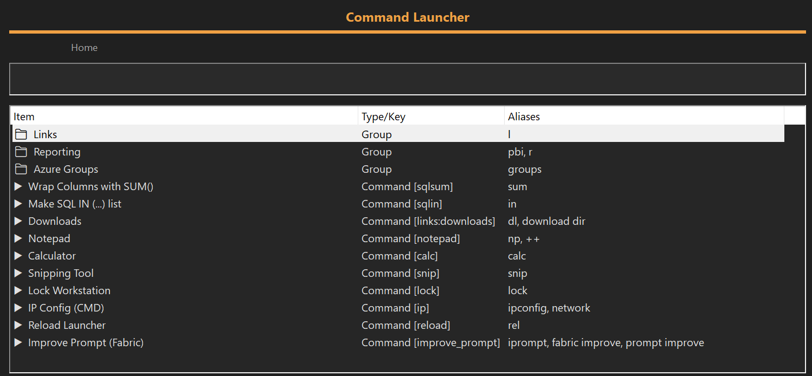

# 🧭 AHK Command Launcher

A fast, dark-mode, Spotlight-style command launcher for Windows built with **AutoHotkey v2**.
Instant fuzzy search, nested groups, action shortcuts, Fabric AI prompt enhancement, and a fully modular architecture.

<br>

## ✨ Features

* ⚡ **Instant fuzzy search** (space-insensitive)
* 🗂 **Nested command groups** (GitHub, Links, custom groups)
* 🌓 **Dark mode UI**
* ↕ **Keyboard-first workflow** (Tab, Enter, Esc, Shift+Tab)
* 🔍 **Enter-to-run even without list focus**
* 🔙 **Search state restoration when navigating back**
* 🧩 **Modular file structure** (GUI, commands, logic)
* 🤖 **Fabric AI integration** via your repo
  → **[Fabric-Prompt-Enhancer](https://github.com/mmcdermott-ashleyne/Fabric-Prompt-Enhancer)**
* 📋 Autocopies AI-enhanced output to clipboard
* 🛠 Easy command customization (open apps, URLs, folders, scripts)

<br>

## 📸 Screenshot




<br>

## 🚀 Installation

### 1. Install AutoHotkey v2

[https://www.autohotkey.com/download/](https://www.autohotkey.com/download/)

### 2. Clone this repository

```sh
git clone https://github.com/mmcdermott-ashleyne/AutoHotKey-Command-Launcher.git
```

### 3. Folder Structure

```
AutoHotKey-Command-Launcher/
  main.ahk
  modules/
    commands.ahk
    gui.ahk
    logic.ahk
```

### 4. Run the launcher

```sh
main.ahk
```

### 5. Open it anytime with:

```
Alt + CapsLock
```

<br>

## 🎮 Usage

### 🔹 Open Launcher

**Alt + CapsLock**

### 🔹 Navigation

| Action               | Key                      |
| -------------------- | ------------------------ |
| Filter / Search      | Type text                |
| Run selection        | **Enter**                |
| Move focus into list | **Tab**                  |
| Go back              | **Shift+Tab** or **Esc** |
| Close from root      | **Esc**                  |
| Help                 | `?` or **F1**            |

### 🔹 Nested Groups

Example:

```
links → Enter → downloads → Enter
```

Pressing Enter on a group opens a submenu.
Pressing **Esc** restores your previous search automatically.

### 🔹 Quick Execution

No need to tab into the list — **Enter** always defaults to the top result when nothing is selected.

<br>

## 🤖 Fabric AI Integration

This launcher includes a built-in command:

```
improve_prompt
```

It works seamlessly with your repository:

➡ **Fabric Prompt Enhancer**
[https://github.com/mmcdermott-ashleyne/Fabric-Prompt-Enhancer](https://github.com/mmcdermott-ashleyne/Fabric-Prompt-Enhancer)

### How it works

1. You select the command `improve_prompt`
2. Launcher hides itself
3. A multi-line prompt dialog appears
4. Your text is piped into:

```
type prompt.txt | fabric --pattern improve_prompt
```

5. Output is captured
6. Launcher copies the enhanced prompt to the clipboard
7. A system tray notification confirms completion

### Requirements

* Fabric CLI installed
* `fabric.exe` located at:

  ```
  C:\tools\fabric.exe
  ```

  (configurable in `logic.ahk`)

<br>

## 🧱 Project Architecture

### `main.ahk`

* Loads hotkeys
* Initializes modules
* Entry point for launcher

### `modules/commands.ahk`

Defines the command registry.
Add/edit launcher commands here.

Example:

```ahk
{ key: "vscode", label: "VS Code", action: (*) => Run("code.exe"), aliases: ["code", "vsc"] }
```

Or nested:

```ahk
{
  key: "web", label: "Web", children: [
    { key: "google", label: "Google", action: (*) => Run("https://google.com") },
    { key: "hackernews", label: "Hacker News", action: (*) => Run("https://news.ycombinator.com") }
  ]
}
```

### `modules/gui.ahk`

Handles:

* Dark mode layout
* Fonts and styling
* Window positioning
* Event hooks

### `modules/logic.ahk`

Handles:

* Fuzzy search
* Multiline prompt dialog
* Navigation stack
* Back/forward behavior
* Enter-to-run fallback
* Fabric piping and output capture

<br>

## 🔌 Adding Your Own Commands

### Simple command

```ahk
{ key: "calc", label: "Calculator", action: (*) => Run("calc.exe") }
```

### Command with argument support

```ahk
{ key: "open", label: "Open Path", action: (arg) => Run(arg) }
```

### Grouped commands

```ahk
{
  key: "devtools", label: "Developer Tools", children: [
    { key: "terminal", label: "Terminal", action: (*) => Run("wt.exe") },
    { key: "github", label: "GitHub", action: (*) => Run("https://github.com") }
  ]
}
```

<br>

## 🐛 Troubleshooting

### Command window flashes or openings appear behind launcher

Ensure GUI uses:

```ahk
+OwnDialogs
```

### Fabric not recognized

Verify the path in `logic.ahk`:

```ahk
fabricExe := "C:\tools\fabric.exe"
```

### Multiline prompt not working

Fabric *requires* the `type file | fabric ...` pattern.
`echo` cannot handle multiline reliably in cmd.

<br>

## ❤️ Contributing

Pull requests welcome!
Ideas:

* Add more built-in commands
* Advanced fuzzy scoring
* Plugin-style command extensions
* UI - Enhancements

<br>

